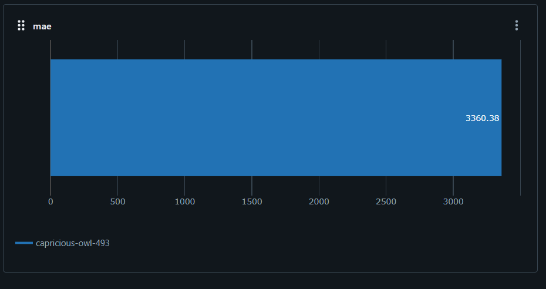

# Introduction 
This is a simple project to demonstrate how to create a supervised machine learning model to predict sales price of used car.
Due to time constraint, we will focus on a subset of variables to do this. 

# Getting Started
1. We will focus on variables without high amount of missing datas and high possibility of correlation to train this model after doing the data exploration.
2. For full list of variables, refer to [config.py](config.py)
2. For more understanding on data, refer to [Exploratory Analysis.ipynb](Exploratory Analysis.ipynb)
3. The data types of the variables are 'object' and is not correct, thus they need to be converted to the correct data types.
4. There are many outliers in the responding variables `sold_amount`, however, they are not removed this round before further discussed with stakeholders and data accuracy's validation
5. Three new features - AvailableWarrantyKM, AvailableWarrantyYears, Year_Sold are generated
6. Full logs can be seen in the logs folder.

# Results
1. The best mean absolute error are around 3300+ dollars. 
2. Given the upper quartile of sold_amount is around 35k, Q3 of 20k and median of 15k, the result is within acceptable range.
3. It is believed that the result will be further improved if those outliers are removed.

# Future Implementation
1. To create a CI/CD pipeline by utilizing Docker, Kubernetes to re-train this model on a schedule and re-deploy the model to production.
2. To investigate the validity of the data and excludes those outliers with extreme values
2. The current prediction score is decent despite short time is allocated to this project. However, we can finetuned the parameters or even use more resource-intensive algorithms
3. MLFlow can be used to do more experiments to find out better-performing models.